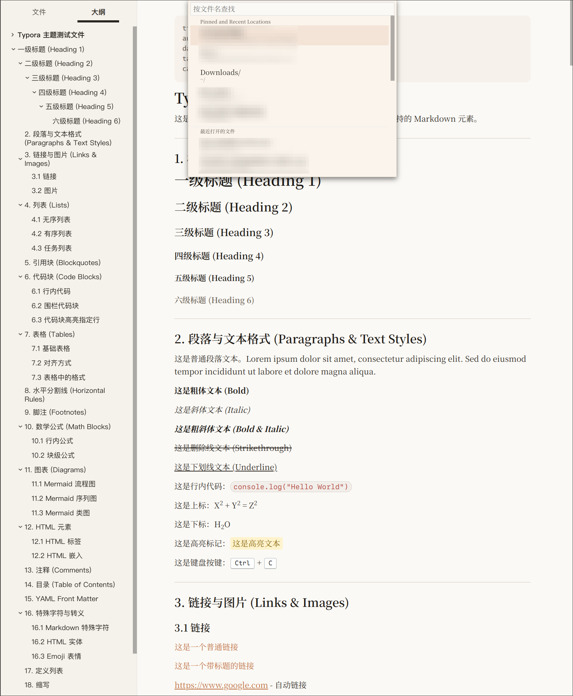
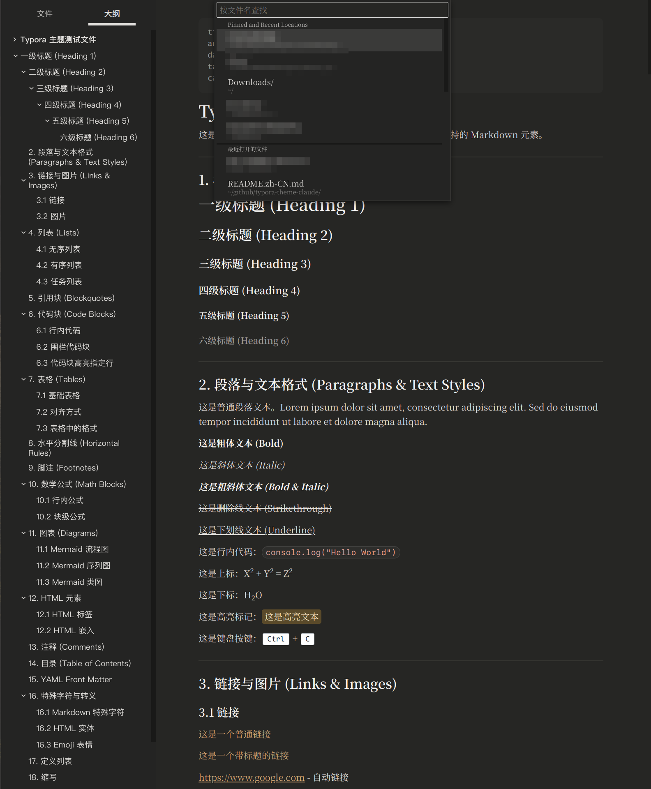

# typora-theme-claude

> A Typora theme inspired by [claude.ai](https://claude.ai) — clean, warm, and remarkably complete.

[中文文档](./README.zh-CN.md)

---

## Preview

### Light

### Dark

---

## Features

- 🎨 **Inspired by claude.ai** — The overall visual language, color palette, and typographic rhythm draw from the Claude interface. The dark theme background color is sampled directly from claude.ai. Note that this is not an exact replica — certain design choices diverge intentionally from the official site.
- 🌑 **Comprehensive dark mode** — Dark theme coverage goes far beyond typical themes. Every element is styled: HTML blocks, and all three Mermaid diagram types (flowchart, sequence, gantt), ensuring a cohesive look with zero jarring contrast.
- 🧪 **Exhaustive style test document included** — A thorough test file covers virtually every Typora element: headings, lists, tables, blockquotes, code blocks, math, diagrams, HTML embeds, and more. What you see is what you get.

---

## Installation

1. Download `claude.css` and `claude-dark.css` from the [Releases](../../releases) page.
2. In Typora, go to **Preferences → Appearance → Open Theme Folder**.
3. Copy both `.css` files into the theme folder.
4. Restart Typora.
5. Go to **Preferences → Appearance → Theme** and select **Claude** (light) or **Claude Dark**.

---

## Style Coverage

| Element | Light | Dark |
|---|:---:|:---:|
| Headings H1–H6 | ✅ | ✅ |
| Paragraphs / Bold / Italic / Bold & Italic | ✅ | ✅ |
| Strikethrough / Underline | ✅ | ✅ |
| Inline code | ✅ | ✅ |
| Superscript / Subscript | ✅ | ✅ |
| Highlight | ✅ | ✅ |
| Keyboard tag `<kbd>` | ✅ | ✅ |
| Links | ✅ | ✅ |
| Unordered / Ordered lists | ✅ | ✅ |
| Task lists | ✅ | ✅ |
| Blockquotes | ✅ | ✅ |
| Fenced code blocks | ✅ | ✅ |
| Tables | ✅ | ✅ |
| Horizontal rules | ✅ | ✅ |
| Footnotes | ✅ | ✅ |
| Inline & block math (KaTeX) | ✅ | ✅ |
| Mermaid flowchart | ✅ | ✅ |
| Mermaid sequence diagram | ✅ | ✅ |
| Mermaid class diagram | ✅ | ✅ |
| HTML blocks (`
`, `
`, etc.) | ✅ | ✅ |
| Table of contents `[TOC]` | ✅ | ✅ |
| YAML Front Matter | ✅ | ✅ |

---

## Acknowledgements

Inspired by [Muyiiiii/Typora_Claude-Like_Theme](https://github.com/Muyiiiii/Typora_Claude-Like_Theme).

---

## License

[MIT](./LICENSE)
