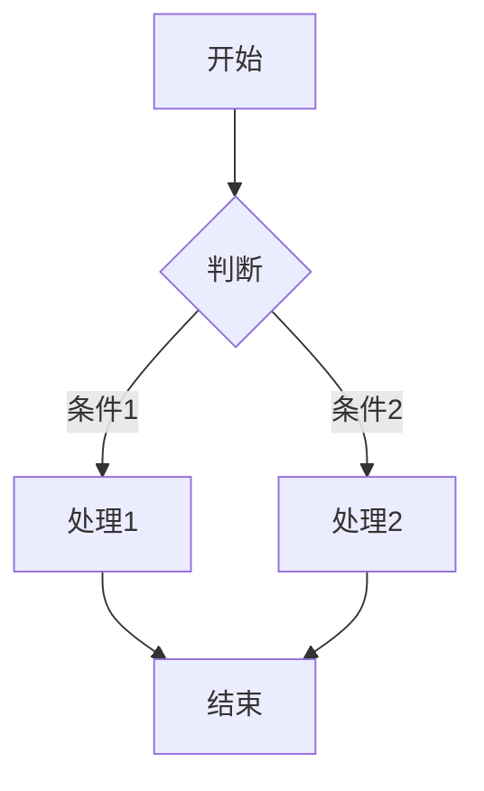
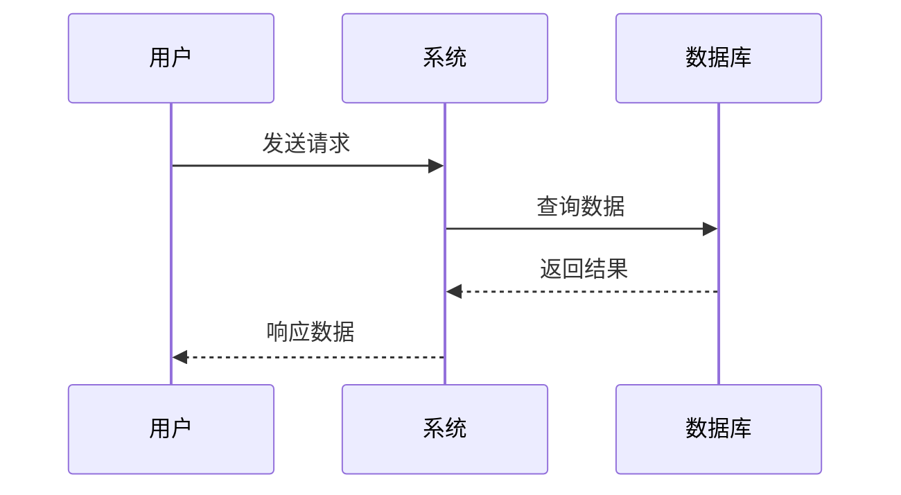
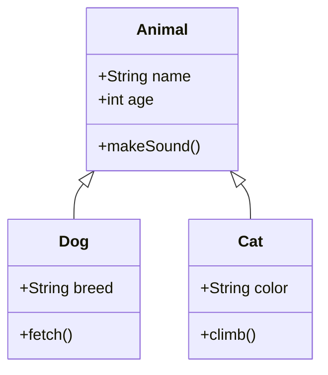

# Typora 主题测试文件

这是一份用于测试 Typora 主题的文件，包含了所有 Typora 支持的 Markdown 元素。

---

## 1. 标题 (Headings)

# 一级标题 (Heading 1)
## 二级标题 (Heading 2)
### 三级标题 (Heading 3)
#### 四级标题 (Heading 4)
##### 五级标题 (Heading 5)
###### 六级标题 (Heading 6)

---

## 2. 段落与文本格式 (Paragraphs & Text Styles)

这是普通段落文本。Lorem ipsum dolor sit amet, consectetur adipiscing elit. Sed do eiusmod tempor incididunt ut labore et dolore magna aliqua.

**这是粗体文本 (Bold)**

*这是斜体文本 (Italic)*

***这是粗斜体文本 (Bold & Italic)***

~~这是删除线文本 (Strikethrough)~~

<u>这是下划线文本 (Underline)</u>

这是行内代码：`console.log("Hello World")`

这是上标：X^2^ + Y^2^ = Z^2^

这是下标：H~2~O

这是高亮标记：==这是高亮文本==

这是键盘按键：<kbd>Ctrl</kbd> + <kbd>C</kbd>

---

## 3. 链接与图片 (Links & Images)

### 3.1 链接

[这是一个普通链接](https://www.google.com)

[这是一个带标题的链接](https://www.google.com "Google 首页")

<https://www.google.com> - 自动链接

[跳转到 1. 标题](#1-标题-headings)

### 3.2 图片


---

## 4. 列表 (Lists)

### 4.1 无序列表

- 第一项
- 第二项
  - 嵌套项 2.1
  - 嵌套项 2.2
    - 更深嵌套 2.2.1
    - 更深嵌套 2.2.2
- 第三项

### 4.2 有序列表

1. 第一项
2. 第二项
   1. 嵌套项 2.1
   2. 嵌套项 2.2
      1. 更深嵌套 2.2.1
      2. 更深嵌套 2.2.2
3. 第三项

### 4.3 任务列表

- [x] 已完成的任务
- [ ] 未完成的任务
- [ ] 另一个未完成的任务
  - [x] 嵌套已完成任务
  - [ ] 嵌套未完成任务

---

## 5. 引用块 (Blockquotes)

> 这是一个引用块。
>
> 这是引用块中的第二段。

> 这是嵌套引用块。
>> 这是嵌套的引用内容。
>>> 更深层次的嵌套。

> 引用块中的其他元素：
>
> - 列表项 1
> - 列表项 2
>
> **粗体文本** 和 *斜体文本*
>
> ```python
> # 代码块在引用中
> print("Hello")
> ```

> [!NOTE]
>
> 这是一个引用块。
>
> 这是引用块中的第二段。

> [!IMPORTANT]
>
> 这是一个引用块。
>
> 这是引用块中的第二段。

> [!CAUTION]
>
> 这是一个引用块。
>
> 这是引用块中的第二段。

---

## 6. 代码块 (Code Blocks)

### 6.1 行内代码

使用 `print()` 函数输出内容。

### 6.2 围栏代码块

```python
# Python 代码示例
def hello_world():
    """这是一个函数文档字符串"""
    message = "Hello, World!"
    print(message)
    return message

# 调用函数
result = hello_world()
```

```javascript
// JavaScript 代码示例
function calculateSum(a, b) {
    // 计算两数之和
    const sum = a + b;
    console.log(`The sum is: ${sum}`);
    return sum;
}

calculateSum(5, 10);
```

```java
// Java 代码示例
public class HelloWorld {
    public static void main(String[] args) {
        System.out.println("Hello, World!");
    }
}
```

```html
<!-- HTML 代码示例 -->
<!DOCTYPE html>
<html>
<head>
    <title>Test Page</title>
</head>
<body>
    <h1>Hello World</h1>
    <p>This is a paragraph.</p>
</body>
</html>
```

```css
/* CSS 代码示例 */
body {
    font-family: Arial, sans-serif;
    background-color: #f5f5f5;
    margin: 0;
    padding: 20px;
}

.container {
    max-width: 1200px;
    margin: 0 auto;
}
```

### 6.3 代码块高亮指定行

```python
def example():
    line1 = "这是第1行"
    line2 = "这是第2行"
    line3 = "这是第3行"
    return line1 + line2 + line3
```

---

## 7. 表格 (Tables)

### 7.1 基础表格

| 表头1 | 表头2 | 表头3 |
| ----- | ----- | ----- |
| 单元格1 | 单元格2 | 单元格3 |
| 单元格4 | 单元格5 | 单元格6 |
| 单元格7 | 单元格8 | 单元格9 |

### 7.2 对齐方式

| 左对齐 | 居中对齐 | 右对齐 |
| :----- | :------: | -----: |
| 内容 | 内容 | 内容 |
| 内容 | 内容 | 内容 |

### 7.3 表格中的格式

| 功能 | 描述 | 示例 |
| ---- | ---- | ---- |
| 粗体 | 使文本加粗 | **粗体文本** |
| 斜体 | 使文本倾斜 | *斜体文本* |
| 代码 | 行内代码 | `code` |
| 链接 | 超链接 | [链接](#) |

---

## 8. 水平分割线 (Horizontal Rules)

---

***

___

---

## 9. 脚注 (Footnotes)

这是一个带脚注的句子[^1]。

这是另一个脚注[^2]。

[^1]: 这是第一个脚注的内容。
[^2]: 这是第二个脚注的内容，可以包含 *格式*。

---

## 10. 数学公式 (Math Blocks)

### 10.1 行内公式

这是行内公式：$E = mc^2$

勾股定理：$a^2 + b^2 = c^2$

### 10.2 块级公式

$$
\frac{d}{dx}\left( \int_{a}^{x} f(t)\,dt \right) = f(x)
$$

$$
\sum_{i=1}^{n} x_i = x_1 + x_2 + \cdots + x_n
$$

$$
\begin{bmatrix}
a & b & c \\
d & e & f \\
g & h & i
\end{bmatrix}
$$

---

## 11. 图表 (Diagrams)

### 11.1 Mermaid 流程图



### 11.2 Mermaid 序列图



### 11.3 Mermaid 类图



---

## 12. HTML 元素

### 12.1 HTML 标签

<details>
	<summary>点击展开详情</summary>
    这是折叠内容。
  - 列表项 1
  - 列表项 2
</details>


<center>这是居中文本</center>

### 12.2 HTML 嵌入

<iframe src="https://www.baidu.com" width="100%" height="200" style="border:1px solid #ccc;"></iframe>

---

## 13. 注释 (Comments)

<!-- 这是 HTML 注释，在预览中不可见 -->

[//]: # (这是另一种注释方式)

---

## 14. 目录 (Table of Contents)

[TOC]

---

## 15. YAML Front Matter

Typora 支持 YAML Front Matter，通常在文件最开头：

```yaml
---
title: "文档标题"
author: "作者名"
date: "2024-01-01"
tags: ["tag1", "tag2"]
categories: ["category1"]
---
```

---

## 16. 特殊字符与转义

### 16.1 Markdown 特殊字符

\* 转义的星号

\_ 转义的下划线

\# 转义的井号

\[ 转义的方括号

\` 转义的反引号

### 16.2 HTML 实体

&copy; 版权符号

&reg; 注册商标

&trade; 商标符号

&hearts; 心形符号

&nbsp; 不间断空格

### 16.3 Emoji 表情

:smile: :heart: :thumbsup: :star: :fire: :rocket:

---

## 17. 定义列表

术语 1
:   这是术语 1 的定义。

术语 2
:   这是术语 2 的定义。
:   术语 2 可以有多个定义。

---

## 18. 缩写

*[HTML]: Hyper Text Markup Language
*[CSS]: Cascading Style Sheets

HTML 和 CSS 是 Web 开发的基础技术。

---

## 19. 标记与标注

### 19.1 标记

==高亮文本== 用于强调重要内容。

### 19.2 下标和上标

化学式：H~2~SO~4~

数学公式：E=mc^2^

---

## 20. 复合示例

> ### 引用块中的标题
> 
> 这是引用块中的段落，包含 **粗体**、*斜体* 和 `代码`。
> 
> > 嵌套引用
> 
> - 列表项 A
> - 列表项 B
> 
> ```python
> # 引用块中的代码
> print("Nested code")
> ```

| 功能 | 说明 | 状态 |
| ---- | ---- | ---- |
| 功能 A | 这是功能的 **详细** 说明 | ✅ 已完成 |
| 功能 B | 包含 `代码` 示例 | 🚧 进行中 |
| 功能 C | [查看文档](#) | ⏳ 待开始 |

---

## 结语

以上就是 Typora 支持的所有 Markdown 元素。这份文档可以用于全面测试和展示 Typora 主题的渲染效果。

**感谢使用！** 🎉
